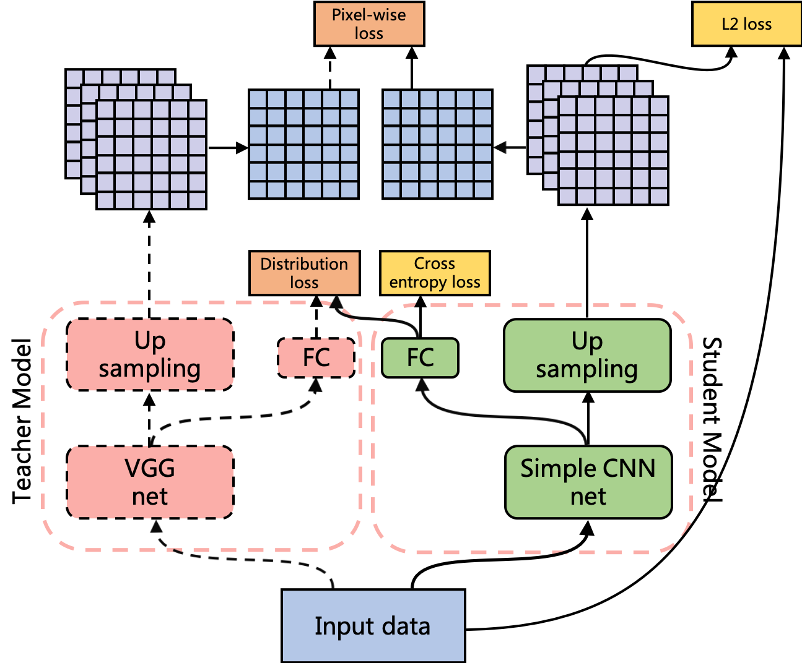

# VGG Model Distillation
BUAA Graduation Project
## Frame

## Experiment Record
- Analyze upsampling alignment's effect to teacher model
    - 100 epoches, batch = 32, old transform, $\lambda_{ce} = 0.1$ 

      | mode | without upsampling | upsampling |
      | ---- | ---- | ---- |
      | accurracy | 86% |  86%  |

    - 20 epoches, batch = 32, new transform, $\lambda_{ce} = 0.1, \lambda_{up} = 5$

      | mode | without upsampling | upsampling |
      | ---- | ---- | ---- |
      | accurracy | 85% |  71%  |

- Pretrain student model
    - 20 epoches, batch = 32, old transform, $\lambda_{ce} = 0.1$ 

      | mode | without upsampling | upsampling |
      | ---- | ---- | ---- |
      | accurracy | 59% |  53%  |

- Fisrt Distill Experiment
    - 20 epoches, batch = 32, $\lambda_{ce} = 0.1$, without pixel-wise distillation, accurracy: $71\%$